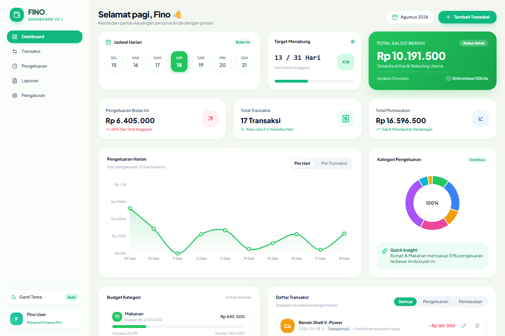
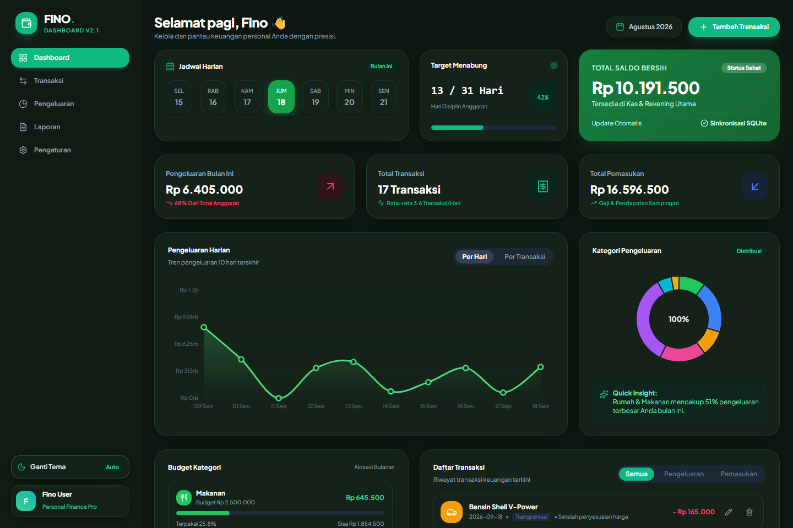
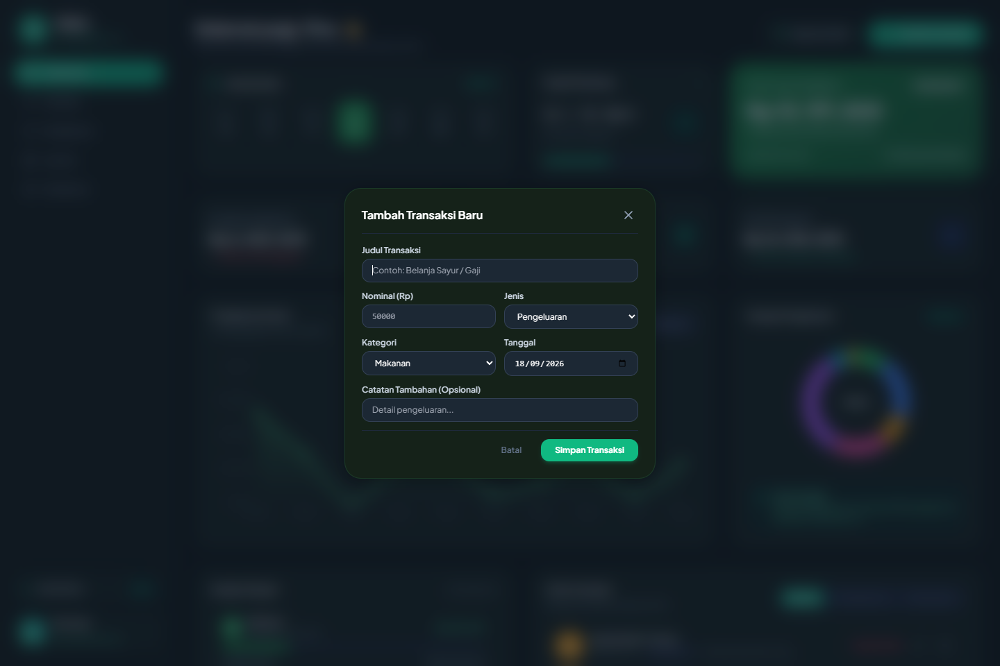

# FINO // Modern Personal & SME Financial Dashboard

[](https://fastapi.tiangolo.com)
[](https://docs.pydantic.dev/)
[](https://tailwindcss.com/)
[](https://github.com/farrrrrrrrrd/apexalpha)

A modern, fun, and human-designed financial budgeting and transaction management dashboard. Features an organic **Matcha Cream** light theme and **Forest Dark** theme, Bento-grid cards, smooth spline expense charts, category budget progress, interactive calendar strip, and modal-based transactions CRUD with instant SQLite persistence.

---

## Visual Previews

### 1. Matcha Cream Light Mode (Bento Grid)


### 2. Forest Dark Mode (High-Contrast Emerald)


### 3. Interactive Modal Dialog (Tambah / Edit Transaksi)


---

## Key Features

- **Matcha & Forest Theme:** Switch between fresh Matcha Cream and deep Forest Dark mode with zero visual glitch.
- **Bento Box Layout:** Playful, rounded-3xl cards with organic micro-interactions and personalized greeting (`Selamat pagi, Fino 👋`).
- **Interactive Calendar Strip:** 7-day pill selector with active day indicator and monthly filtering.
- **Smooth Spline Area Chart:** Real-time Bezier curved chart visualizing daily expense trends over the last 10 days.
- **Category Donut & Budget Bars:** Monitor spending distributions (Makanan, Tagihan, Transportasi, Belanja, Rumah, Pendidikan, Hiburan) against allocated budgets.
- **Full Transaction CRUD Modal:** Add, edit, or delete transactions with Rupiah currency formatting and instant SQLite persistence.
- **Pydantic v2 & FastAPI Backend:** Asynchronous API endpoints with strict validation, parameterized queries, and OWASP injection defenses.

---

## Project Structure

```text
apexalpha/
├── .agents/rules/AGENTS.md           # Zero-Slop Rules & Model Inherit Standards
├── assets/                           # High-resolution screenshots
│   ├── fino_light.png
│   ├── fino_dark.png
│   └── fino_modal.png
├── backend/
│   ├── app/
│   │   ├── domain/models.py          # Pydantic v2 transaction schemas
│   │   ├── repository/db.py          # SQLite database CRUD and summary aggregations
│   │   ├── api/routes.py             # FastAPI REST endpoints
│   │   └── main.py                   # App entrypoint, CORS, static frontend mount
├── frontend/
│   ├── css/style.css                 # Matcha & Forest theme styles
│   ├── js/
│   │   ├── api.js                    # REST API client
│   │   ├── charts.js                 # Smooth spline & donut Canvas charts
│   │   └── app.js                    # UI state, calendar strip, modal logic
│   └── index.html                    # FINO Bento Dashboard UI
├── tests/
│   ├── test_fino_crud.py             # Unit tests for transaction CRUD & aggregations
│   └── test_api_security.py          # OWASP injection & input validation tests
└── README.md
```

---

## Quick Start

1. Start backend server:
   ```bash
   python -m uvicorn backend.app.main:app --port 8050 --reload
   ```

2. Open dashboard in your web browser:
   **`http://localhost:8050`**

3. Try out:
   - Click **"Ganti Tema"** to toggle between Matcha Light Mode and Forest Dark Mode.
   - Click **"+ Tambah Transaksi"** to record an expense or income via the modal.
   - Click the pencil icon on any transaction row to edit its details.
   - Filter transactions using the **Semua / Pengeluaran / Pemasukan** tabs.

---

## Unit Testing & Verification

Run the test suite:
```bash
python -m unittest tests/test_fino_crud.py
```
```text
....
----------------------------------------------------------------------
Ran 4 tests in 0.063s

OK
```

---

## License

MIT © [farrrrrrrrrd](https://github.com/farrrrrrrrrd)
