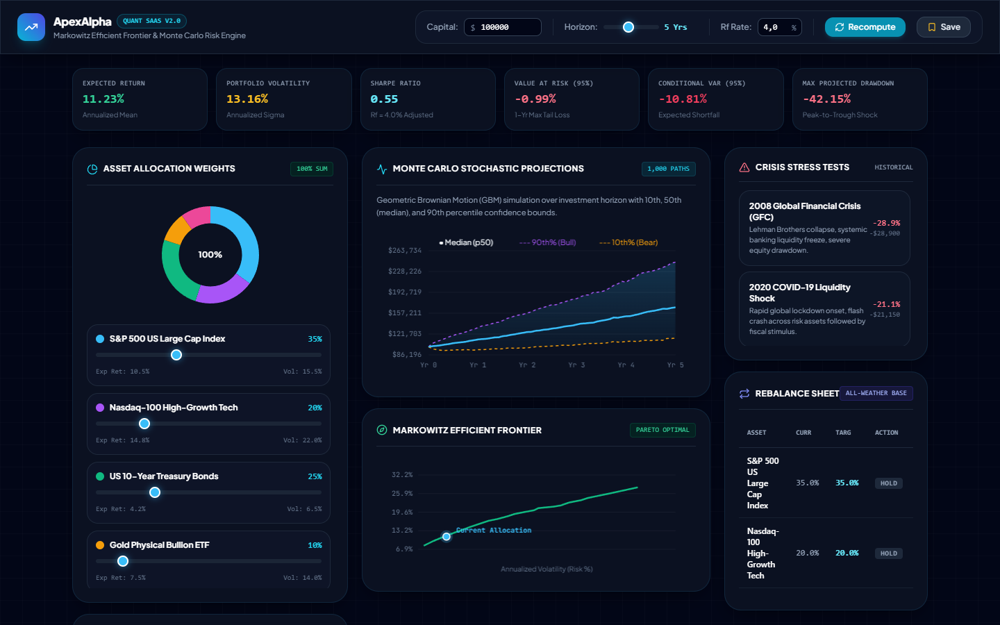
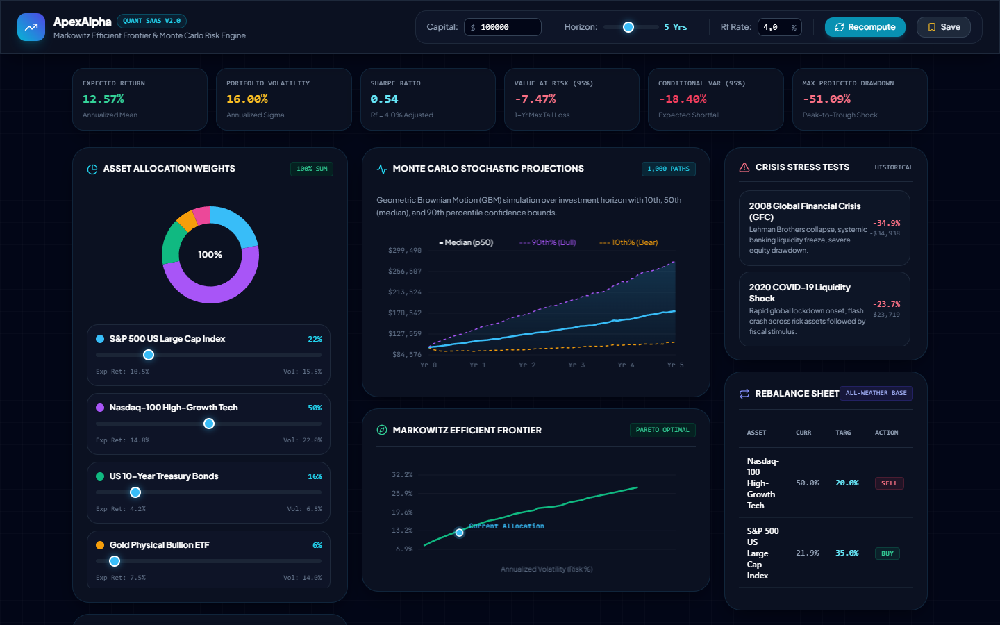

# ApexAlpha // Quantitative Portfolio Optimizer & Monte Carlo Risk Engine SaaS

[](https://fastapi.tiangolo.com)
[](https://docs.pydantic.dev/)
[](https://numpy.org/)
[](https://github.com/farrrrrrrrrd/apexalpha)

A production-grade Quantitative Finance SaaS platform providing real-time portfolio optimization, Markowitz Modern Portfolio Theory (MPT) Efficient Frontier analysis, 1,000-path Geometric Brownian Motion (GBM) Monte Carlo stochastic projections, Value-at-Risk (VaR/CVaR), historical crisis stress-testing, and automated self-financing portfolio rebalancing.

---

## Visual Previews

### 1. Balanced All-Weather Portfolio Dashboard


### 2. High-Tech Overweight Rebalancing & Risk Projection


---

## Quantitative Mathematical Formulations

### 1. Modern Portfolio Theory (Markowitz Mean-Variance)
- **Expected Portfolio Return:**
  $$\mu_p = \mathbf{w}^T \boldsymbol{\mu} = \sum_{i=1}^N w_i \mu_i$$
- **Portfolio Return Variance:**
  $$\sigma_p^2 = \mathbf{w}^T \mathbf{\Sigma} \mathbf{w} = \sum_{i=1}^N \sum_{j=1}^N w_i w_j \Sigma_{ij}$$
- **Sharpe Ratio (with singular safeguard):**
  $$S_p = \frac{\mu_p - R_f}{\max(\sigma_p, 10^{-8})}$$

### 2. Geometric Brownian Motion (GBM) Stochastic Simulation
Discrete-time update with exact Itô drift correction:
$$S_{t+\Delta t} = S_t \exp\left( \left(\mu - \frac{1}{2}\sigma^2\right)\Delta t + \sigma \sqrt{\Delta t} Z \right), \quad Z \sim \mathcal{N}(0, 1)$$

### 3. Empirical Value-at-Risk (VaR) & Conditional VaR (CVaR)
- **$\text{VaR}_{95\%}$:** 5th percentile worst return of the terminal distribution.
- **$\text{CVaR}_{95\%}$ (Expected Shortfall):** Mean of the tail losses exceeding $\text{VaR}_{95\%}$:
  $$\text{CVaR}_\alpha = \mathbb{E}[L \mid L \ge \text{VaR}_\alpha]$$

### 4. Self-Financing Rebalancing Invariant
$$\sum_{i=1}^N \Delta w_i = \sum_{i=1}^N (w_i^{\text{target}} - w_i^{\text{current}}) = 1.0 - 1.0 = 0$$
Capital released from liquidating overweight positions strictly covers the capital required to fund underweight positions.

---

## Clean Architecture Directory Structure

```text
apexalpha/
├── .agents/rules/AGENTS.md           # Zero-Slop Architecture & Model Inherit Rules
├── assets/                           # High-resolution screenshots
├── backend/
│   ├── app/
│   │   ├── domain/models.py          # Strict Pydantic v2 domain schemas
│   │   ├── engine/
│   │   │   ├── markowitz.py          # Covariance matrix & Efficient Frontier
│   │   │   ├── monte_carlo.py        # GBM stochastic paths (1000 paths) & VaR/CVaR
│   │   │   ├── stress_test.py        # Historical crises simulation (2008, 2020, 2022)
│   │   │   └── rebalancer.py         # Zero-sum Buy/Sell order generator
│   │   ├── repository/db.py          # SQLite database persistence & asset universe
│   │   ├── api/routes.py             # FastAPI async REST endpoints
│   │   └── main.py                   # App entrypoint, CORS, static frontend mount
├── frontend/
│   ├── css/style.css                 # Fintech dark mode glassmorphism
│   ├── js/
│   │   ├── api.js                    # REST API client
│   │   ├── charts.js                 # 2D Canvas Monte Carlo ribbon & Frontier curve
│   │   └── app.js                    # Dynamic reactive state & slider normalizer
│   └── index.html                    # Bloomberg-grade dashboard UI
├── tests/
│   ├── test_markowitz.py             # MPT variance, return, and Sharpe tests
│   ├── test_monte_carlo.py           # GBM stochastic path & VaR invariant tests
│   ├── test_rebalancer.py            # Conservation of capital rebalance tests
│   └── test_api_security.py          # OWASP injection & input validation tests
└── README.md
```

---

## Quick Start

1. Start FastAPI backend & static server:
   ```bash
   python -m uvicorn backend.app.main:app --port 8050 --reload
   ```

2. Open dashboard in your web browser:
   **`http://localhost:8050`**

3. Interactive capabilities:
   - **Adjust Sliders:** Move asset weight sliders; remaining weights auto-normalize to preserve $100\%$ sum.
   - **Real-Time Recompute:** Live recalculation of return, volatility, Sharpe ratio, VaR, and max drawdown.
   - **Historical Stress-Tests:** Inspect impact of 2008 Lehman crisis, 2020 Covid flash crash, and 2022 rate hike cycles.
   - **Execution Orders:** Review generated Buy/Sell orders required to realign with target all-weather allocation.
   - **Persistence:** Save custom portfolios directly to the local SQLite database.

---

## Unit Testing & Verification

Run the complete 13-test quantitative suite:
```bash
python -m unittest discover tests
```
```text
.............
----------------------------------------------------------------------
Ran 13 tests in 0.026s

OK
```

---

## License

MIT © [farrrrrrrrrd](https://github.com/farrrrrrrrrd)
